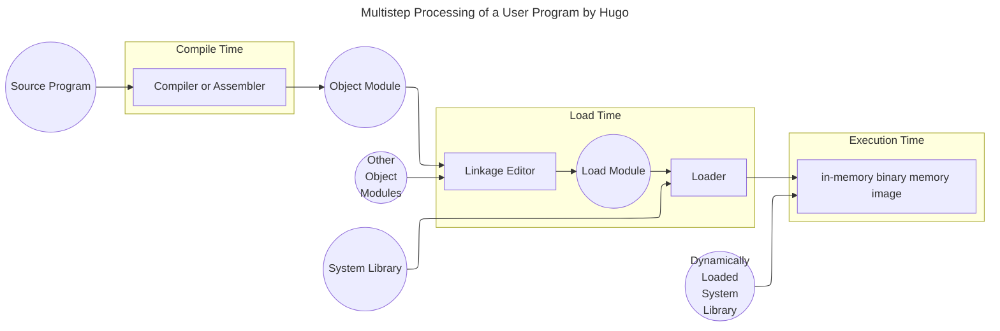

Since I frequently use **Markdown** to write technical documents and also love recording my life with it, I am currently developing a [VSCode] extension - [Markdown Everything]. The aim is to enhance the preview of Markdown rendering and meet my customized needs.

Before [MARKDOWN EVERYTHING], you need to know how to markdown. This document will help you to understand the basic markdown syntax.

[MARKDOWN EVERYTHING]: https://marketplace.visualstudio.com/items?itemName=1chooo.markdown-everything
[MARKDOWN EVERYTHING]: https://marketplace.visualstudio.com/items?itemName=1chooo.markdown-everything

## Headers

To use the headers, you can use `#` to `######` for Header 1 to Header 6. And it will be helpful to understand the structure of the document.


```markdown
# This is Header 1
## This is Header 2
### This is Header 3
#### This is Header 4
##### This is Header 5
###### This is Header 6
```


## Emphasis

To make the words vividly, you can add the emphasis adaptively.


```markdown
- *This text will be italic* or _This text will be italic_
- **This text will be bold** or __This text will be bold__
- ***This text will be italic and bold*** or ___This text will be italic and bold___
- ~~This text will be strikethrough~~
- <u>This text will be underlined</u>
- <sup>This text will be superscript</sup>
- <sub>This text will be subscript</sub>
```


## Lists

There are two types of lists, unordered and ordered. You can use `*` for unordered and `1.` for ordered. And you can use the combination of them.

### Unordered


```markdown
- `* Item 1`
- `* Item 2`
  - `* Item 2a`
  - `* Item 2b`
  - `* Item 2c`
    - `* Item 2c1`
    - `* Item 2c2`
```

### Ordered


```markdown
1. `1. Item 1`
2. `2. Item 2`
   1. `1. Item 2a`
   2. `2. Item 2b`
   3. `3. Item 2c`
      1. `1. Item 2c1`
      2. `2. Item 2c2`
```

### Combined


```markdown
1. `1. Item 1`
2. `2. Item 2`
   - `* Item 2a`
   - `* Item 2b`
   - `* Item 2c`
      1. `1. Item 2c1`
      2. `2. Item 2c2`
```


**💡 TIP**
To insert a line break within a text field, you can use the keyboard shortcut `Shift + Enter`. This allows you to start a new line without ending the current paragraph.



## Links

We can add links in markdown with the hyerlink.


```markdown
- [Hugo's Portfolio](https://1chooo.com)
- [Hugo's Blog](https://blog.1chooo.com)

Sample: [alt text](url)
```


## Images

We can embed images in markdown with the file path or URL.


```markdown


Sample: 
```


## Code

We can use inline code and code block in markdown to represent the code.

### Inline Code

We can use the backticks <code>\`</code> to create the inline code.


```markdown
`print("Hello, World!")`
```

### Code Block

With three backticks <code>\`\`\`</code>, we can create the code block. Also, we can specify the language to highlight the syntax next to the first three backticks, such as <code>\`\`\`python</code>.


````markdown
```python
def foo() -> str:
    """
    This is a function to return the string 'bar'
    
    Returns:
        str: 'bar'
    """
    return 'bar'
```
````

## Quotes

We can use the `>` to create the quotes in markdown.


````markdown
> "This is a quote."
>
> 1. Item 1
> 2. Item 2
>     - Item 2a

> **Python Hello World:**
>
> ```python
> print('Hello, World!')
> ```
````


## Alert

In GitHub, it supports the render of alerts. You can use the following syntax to create alerts, also known as callouts.


```markdown
> [!NOTE]
> Useful information that users should know, even when skimming content.

> [!TIP]
> Helpful advice for doing things better or more easily.

> [!IMPORTANT]
> Key information users need to know to achieve their goal.

> [!WARNING]
> Urgent info that needs immediate user attention to avoid problems.

> [!CAUTION]
> Advises about risks or negative outcomes of certain actions.
```


## Tables

You can create the tables to represent the data in markdown.


```markdown
| Header 1 | Header 2 | Header 3 |
| -------- | -------- | -------- |
| Cell 1   | Cell 2   | Cell 3   |
| Cell 4   | Cell 5   | Cell 6   |
```


## Ignore Markdown

If you want to ignore the markdown syntax, you can use the backslash `\`. If you want to ignore the markdown syntax in the whole line, you can use the `<!-- -->` to comment out the line.


```markdown
Let's \*\*rename\*\* the variable \`var\` in with \`var2\` in the \`main.py\`

<!-- This content will not appear in the rendered Markdown -->
```


**💡 TIP**
Sometimes, I will use `HTML` to ignore the markdown syntax.


## Footnotes

We can add the footnotes in markdown to provide additional information.


[Markdown-Everything]: https://marketplace.visualstudio.com/items?itemName=1chooo.markdown-everything

[VSCode]: https://code.visualstudio.com/

````markdown
This is Hugo Speaking 👨🏻‍💻 [^1], [^bignote], [^2]

[^1]: This is the first footnote.

[^2]: [Hugo](https://1chooo.com)

[^bignote]: Here's one with multiple paragraphs and code.

    Indent paragraphs to include them in the footnote.

    `{ my code }`

    Add as many paragraphs as you like.

    ```python
    def foo():
        return 'bar'
    ```
````


## Math

In markdown, we can use the $\LaTeX$ syntax to represent the math equations. We can use the inline math with `$` and block math with `$$`.


```markdown
- Inline Math: $E = mc^2$
- Block Math:

$$
\int_{-\infty}^\infty e^{-x^2} dx = \sqrt{\pi}
$$

- Algorithm:

$$
\begin{array}{l}
\textbf{Algorithm 1 QuickSort(array A, l, r)} \\
1.\ \text{if}\ r - l + 1 \leq 1\ \text{then} \\
2.\ \quad \text{return} \\
3.\ \text{end if} \\
4.\ p = \text{ChoicePivot}(A, l, r) \\
5.\ \text{Partition}(A, p, l, r) \\
6.\ \text{QuickSort}(A, l, p - 1) \\
7.\ \text{QuickSort}(A, p + 1, r) \\
\end{array}
$$
```


## Expandable Sections

We can create the expandable sections in markdown to hide the content.


 
Hi.


 



```markdown
<details>

<summary>👉🏻 Click Me to expand</summary>

Hi.


</details>

<details>

<summary>👉🏻 Click Me to expand</summary>

Hi.


</details>
```


## Chart

We can plot a variety of charts with `mermaid` syntax in markdown. Let's take `flowchart` as an example. If you want more examples, you can visit the [Mermaid.js - Tutorial].

[Mermaid.js - Tutorial]: https://mermaid.js.org/ecosystem/tutorials.html


````markdown

````

Finally!!! These are all the tips I use to write proficient notes on GitHub with Markdown. I hope everyone can also MARK the wonderful content DOWN!